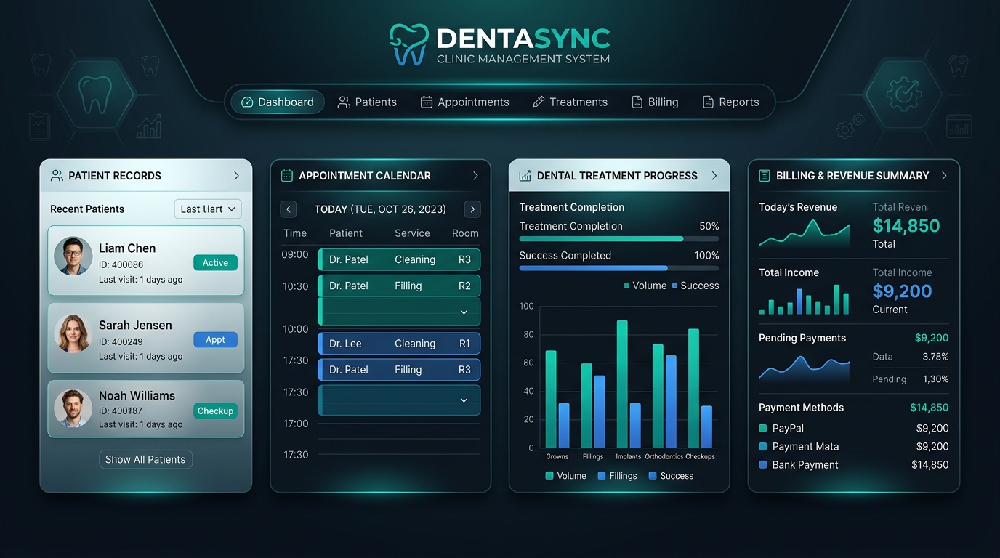
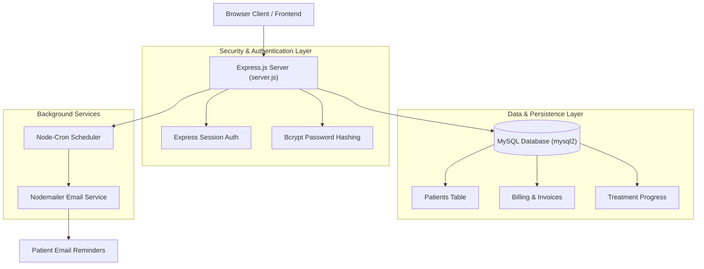

<div align="center">

  

  # 🦷 Dental Clinic Management System & Patient Portal

  **A comprehensive, full-stack clinical management web application built with Node.js, Express, MySQL, Session Authentication, Automated Reminders, and Clinical Workflows.**

  [](https://nodejs.org/)
  [](https://expressjs.com/)
  [](https://www.mysql.com/)
  [](https://github.com/kelektiv/node.bcrypt.js)
  [](https://nodemailer.com/)
  [](https://github.com/node-cron/node-cron)

</div>

---

## 📋 Features Overview

- **👤 Patient Management System**: Complete CRUD operations for patient profiles, medical history, contact details, and emergency contacts.
- **📈 Treatment Progress Tracker**: Visual progress logging for dental procedures, ongoing treatments, and clinical history.
- **📄 Digital Prescription Generator**: Fast creation, formatting, and issuance of dental prescriptions.
- **💳 Automated Billing & Invoicing**: Calculate service charges, generate itemized bills, and track patient payment status.
- **⏰ Scheduled Notifications & Reminders**: Automated email notifications powered by `nodemailer` and `node-cron` for appointment reminders.
- **🔐 Secure Authentication & Session Management**: Password encryption with `bcrypt` and secure user session persistence with `express-session`.
- **📊 Patient Search & Database Migration**: Fast patient querying and automated SQL database migration scripts.

---

## 🏗️ System & Database Architecture



---

## 📂 Repository Structure

```
dentist-projectt/
├── assets/
│   └── banner.png                   # Repository visual header
├── add_patient_html.txt             # Patient registration view markup
├── billing_html.txt                 # Billing & invoicing layout
├── database_setup_sql.txt           # Primary database schema script
├── edit_patient_html.txt            # Patient profile editing view
├── index_html.txt                   # Main clinic dashboard view
├── login_html.txt                   # Staff authentication portal
├── migrate_sql.txt                  # Database migration queries
├── notification_config_js.txt       # Email & cron reminder config
├── package_json.txt                 # Dependencies list & configuration
├── patients_records_html.txt        # Master patient records table
├── prescription_html.txt            # Prescription builder template
├── script_js.txt                    # Frontend interactivity & AJAX handlers
├── search_patient_html.txt          # Patient search & query tool
├── server_js.txt                    # Express API routes & server setup
├── style_css.txt                    # Responsive clinic UI stylesheet
└── treatment_progress_html.txt      # Treatment tracking view
```

---

## 🚀 Setup & Installation Guide

### Prerequisites
1. **Node.js** (`v18.0.0` or higher) installed on your machine.
2. **MySQL Server** running locally or on a remote host.

### Database Setup
1. Import and run `database_setup_sql.txt` in your MySQL management tool (MySQL Workbench, phpMyAdmin, or CLI):
   ```sql
   SOURCE database_setup_sql.txt;
   ```
2. (Optional) Run `migrate_sql.txt` if updating from a previous version.

### Backend Configuration & Launch

1. **Clone the repository**:
   ```bash
   git clone https://github.com/yugsuthar208/dentist-projectt.git
   cd dentist-projectt
   ```

2. **Install Node.js dependencies**:
   ```bash
   npm install express mysql2 bcrypt express-session nodemailer node-cron cors
   ```

3. **Configure Database Connection**:
   Ensure your MySQL credentials (`host`, `user`, `password`, `database`) match in `server_js.txt`.

4. **Run the Application**:
   ```bash
   node server.js
   ```

5. Open [http://localhost:3000](http://localhost:3000) in your web browser.

---

## 🛠️ Key Dependencies Summary

| Package | Version | Purpose |
|---|---|---|
| `express` | `^4.21.2` | Core Web Server & REST API Framework |
| `mysql2` | `^3.12.0` | MySQL Database Connector & Query Execution |
| `bcrypt` | `^5.1.1` | Password Cryptographic Hashing |
| `express-session` | `^1.18.1` | Session Middleware & Auth Tokens |
| `nodemailer` | `^6.10.0` | Outbound Email Dispatch Engine |
| `node-cron` | `^3.0.3` | Background Task Scheduling & Reminders |
| `cors` | `^2.8.5` | Cross-Origin Resource Sharing |

---

## 📄 License

This project is licensed under the MIT License.
